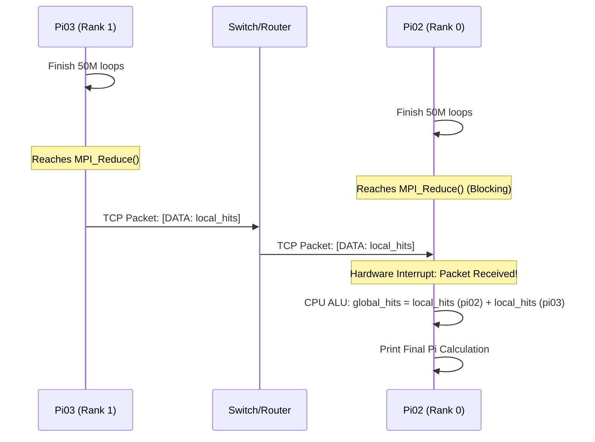

# Deep Dive: The Monte Carlo Pi MPI Simulation

This document provides a highly detailed breakdown of the `sim_pi_mpi.c` script. It covers the mathematical concept, the code execution flow, the specific MPI functions, and the behind-the-scenes hardware and network communications that make this parallel cluster possible.

---

## 1. The Mathematical Concept
The script estimates the value of **Pi (π)** using a **Monte Carlo Simulation**. 
Imagine a square dartboard with a circle perfectly inscribed inside it. If you throw millions of darts randomly at the board:
- The ratio of darts that land *inside the circle* versus the *total darts thrown* will approximate the ratio of their areas.
- Area of Circle / Area of Square = $ \pi r^2 / (2r)^2 = \pi / 4 $.
- Therefore, $ \pi \approx 4 \times (\text{Hits in Circle} / \text{Total Darts}) $.

This is an **embarrassingly parallel** problem. `pi02` and `pi03` can throw 50 million darts entirely independently, requiring zero network communication until the very end when they combine their scores.

---

## 2. The Call Chain & Code Flow

When you execute `mpirun`, the exact same compiled binary (`sim_pi_mpi_arm`) runs simultaneously on both Raspberry Pis. The code diverges based on the **Rank** (the ID assigned to each Pi).

1. **Bootstrapping**: `MPI_Init` wires up the network.
2. **Identity Check**: `MPI_Comm_rank` tells `pi02` it is Rank 0, and `pi03` it is Rank 1.
3. **Environment Setup**: Both nodes grab their hostnames and seed their random number generators uniquely using their rank.
4. **Compute Loop**: Both CPUs locally grind through a `for` loop 50,000,000 times, doing basic arithmetic to see if $x^2 + y^2 \leq 1$.
5. **The Sync**: Execution halts at `MPI_Reduce`. `pi03` sends its score over the network. `pi02` waits to receive it and adds it to its own score.
6. **Output**: Rank 0 (`pi02`) prints the final combined math.
7. **Teardown**: `MPI_Finalize` closes the network sockets and exits.

---

## 3. Function Breakdown

### MPI Functions
* `MPI_Init(&argc, &argv)`
  * **What it does**: Initializes the MPI execution environment.
  * **Behind the scenes**: It parses the command line arguments passed by `mpirun`, locates the OpenMPI daemons (`orted`) running on the hardware, and allocates memory for network buffers.
* `MPI_Comm_rank(MPI_COMM_WORLD, &rank)`
  * **What it does**: Asks the cluster, "Who am I?" 
  * **Behind the scenes**: Checks the local daemon to get its integer ID (0 for `pi02`, 1 for `pi03`) within the `MPI_COMM_WORLD` (the global communicator group).
* `MPI_Comm_size(MPI_COMM_WORLD, &size)`
  * **What it does**: Asks the cluster, "How many of us are there?" Returns `2`.
* `MPI_Reduce(&local_hits, &global_hits, 1, MPI_LONG_LONG, MPI_SUM, 0, MPI_COMM_WORLD)`
  * **What it does**: The most critical function. It takes the `local_hits` variable from *every* node, applies a mathematical operation to them (`MPI_SUM`), and stores the resulting sum in the `global_hits` variable on the root node (`0`). 

### Standard C Functions
* `gethostname(hostname, ...)`: Queries the Linux kernel to get the machine name (`pi02` or `pi03`) so we can visibly prove where the code is executing.
* `srand(time(NULL) + rank * 9999)`: Seeds the random number generator. **Crucial step**: If we didn't add `rank * 9999`, both Pis would initialize with the exact same millisecond timestamp and generate the *exact same* 50 million "random" darts, rendering the parallelization useless!
* `rand()`: Generates a pseudo-random integer which we divide to get a floating-point coordinate between -1.0 and 1.0.

---

## 4. Behind the Scenes: Hardware & Network Comms

When you run `mpirun --host pi02.local,pi03.local -n 2 /tmp/sim_pi_mpi_arm`, a complex chain of hardware events occurs.

### Phase 1: The SSH Mesh & Spawning
1. The `mpirun` process starts on `pi02`.
2. It looks at the `--host` list. It realizes it needs to start a process on `pi03.local`.
3. `pi02` silently opens an SSH connection to `pi03` (using the passwordless RSA keys we generated).
4. Over that SSH connection, it spawns an OpenMPI daemon (`orted`) on `pi03`.
5. The daemon on `pi03` loads the `/tmp/sim_pi_mpi_arm` binary from its local SD card/RAM into its CPU instruction cache and executes it.

### Phase 2: Execution (High CPU, Zero Network)
1. Both `pi02` and `pi03` are now running the C binary.
2. The `for` loop kicks in. For the next ~1-2 seconds, the ARM CPUs on both Raspberry Pis run at 100% utilization.
3. This occurs entirely inside the L1/L2 CPU Cache and ALU (Arithmetic Logic Unit). During this time, **zero network traffic** is sent between the Pis. This is why this architecture is highly scalable.

### Phase 3: MPI_Reduce (The Network Sync)

1. As soon as `pi03` finishes its loop, it hits the `MPI_Reduce` function.
2. The OpenMPI library on `pi03` takes the 64-bit integer (`local_hits`), packages it into a TCP/IP packet, and sends it out of the Pi's physical Ethernet/Wi-Fi interface.
3. `pi02` hits `MPI_Reduce` and **blocks** (freezes execution), listening on its network socket.
4. The packet arrives at `pi02`'s network interface, triggering a hardware interrupt. 
5. The Linux kernel on `pi02` hands the packet payload to the OpenMPI library.
6. The ARM CPU on `pi02` executes an `ADD` instruction, summing its own hits with `pi03`'s hits, storing it in `global_hits`.
7. `pi02` prints the result, hits `MPI_Finalize`, and sends a final TCP `FIN` packet to gracefully collapse the cluster communicators.
